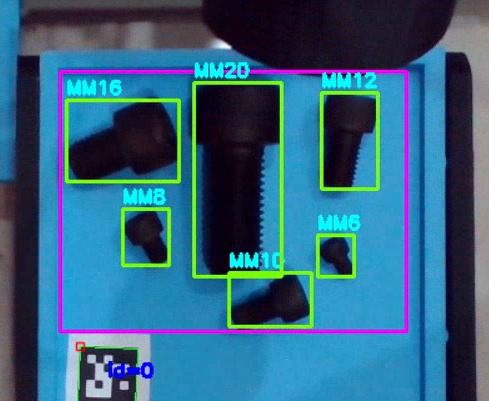

# 3DoF Robotic Bolt Lifter

## Overview

3DoF Bolt Lifter is a Python-based robotic manipulation system designed to identify, pick, place, and sort bolts using a three-degree-of-freedom robotic arm equipped with an electromagnetic end effector.

The system integrates computer vision, robot kinematics, motion planning, and microcontroller-based actuation to perform automated bolt handling tasks. This repository contains the software, simulation tools, firmware, and machine learning models required for object detection and robotic arm control. 

---

## Demonstration





*Real-time bolt detection and classification using a custom-trained YOLO model with Contour-based feature extraction.*


---

## Features

* 3DoF robotic arm control
* Electromagnetic end-effector actuation
* Bolt detection using YOLO object detection
* Automated pick-and-place operations
* Bolt sorting based on detected class
* Forward kinematics visualization
* Inverse kinematics solver and simulation
* Serial communication with Arduino-based controller

---


## Dependencies

Install required packages using:

```bash
pip install -r requirements.txt
```

---

## Installation

Clone the repository:

```bash
git clone https://github.com/Ahmed-Medhat-Hussein/3DoF_Bolt_Lifter.git
cd 3DoF_Bolt_Lifter
```

Create a virtual environment:

```bash
python -m venv venv
```

Activate the environment:

### Windows

```bash
venv\Scripts\activate
```

### Linux/macOS

```bash
source venv/bin/activate
```

Install dependencies:

```bash
pip install -r requirements.txt
```

---
## Project Structure

```text
3DoF_Bolt_Lifter/
│
├── main.py
├── fk_visualizer.py
├── ik_solver_vizualizer.py
├── bolt_pick_simulation_fullframe.py
├── bolt_pick_simulation_roi.py
├── requirements.txt
├── README.md
|
├── Arduino_Firmware/
│   └── Robot_Controller.ino
│
├── Kinematics/
│   ├── RobotConfig.py
│   └── kinematics.py
|
├── motion/
|   |── RobotArmController.py
│   └── MotionPlan.py
|
|── yolo_weights/
|   |── best.pt
|   |── last.pt
|   └── extra_files/
|
|── STLs/
|   |── 
|   |── 
|   └── 
│
└── tools/
    |── ROI_ext.py
    └── Contour_Detect.py
```
